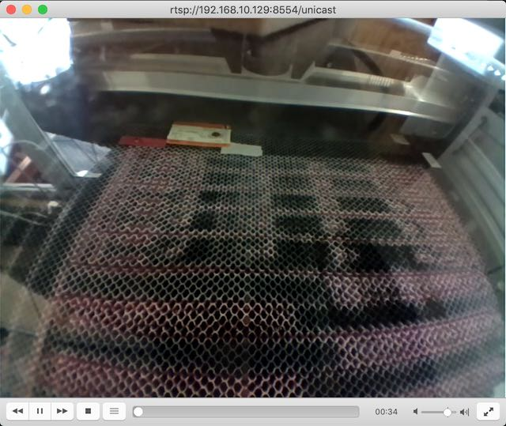

# Raspberry Pi Zero based RTSP (streaming) camera

This is a simple webcam that uses a Raspberry Pi Zero wireless with a Pi Camera and streams the images using RTSP.

## Hardware
- Raspberry Pi Zero Wireless
- [Pi Camera with 160° wide-angle lens and variable-focus lens](https://shop.pimoroni.com/products/raspberry-pi-zero-camera-module?variant=3031238213642)

## Software
- Raspbian 10 Buster Lite
- v4l2rtspserver
- nginx

## Background
This configures your Raspberry Pi Zero wireless to act as a RSTP camera server, streaming your Pi camera over the network.  It configures your system from out of the box tohaving a network video stream.  I use this to monitor my laser cutter.  The camera and Pi are sitting on the transparent lid of my laser cutter facing down, which means I need to flip the horizontal and vertical image.  I have set the resoltion for be 640x480, but you are welcome to change that to whatever suits you best.  It installs nginx as a simple webserver to allow me to quickly see the stream configuration only.  v4l2rtspserver streams the video image from the Pi with minimal CPU overhead. I also use motion/motioneye/motioneyeos running on another server to process and store the streamed images.

## Installation
1. Download Raspbian 10 Buster Lite image from [https://downloads.raspberrypi.org/raspbian_lite_latest](https://downloads.raspberrypi.org/raspbian_lite_latest)
1. Download and install Balener Etcher from [https://www.balena.io/etcher/](https://www.balena.io/etcher/)
1. Write the image to an SD card using Balener Etcher
1. Whilst the SD card is still mounted, edit /Volumes/BOOT/wpa_supplicant.conf, paste in the following, edit and save:
    ```
    country=GB
    ctrl_interface=DIR=/var/run/wpa_supplicant GROUP=netdev
    update_config=1
    network={
      scan_ssid=1
      ssid="your-wifi-network"
      psk="your-wifi-password"
    }
    ```
1. Enable SSH Daemon upon boot: `touch /Volumes/BOOT/ssh`
1. Place SD card into Pi and power it on
1. Discern your Pi's IP address
1. SSH in: `ssh pi@192.168.10.129`
1. Run the following commands:
    ```
    passwd
    sudo su -
    apt-get update
    apt-get upgrade
    apt-get install git cmake nginx vim screen -y
    mkdir ~/git
    cd ~/git
    git clone https://github.com/mpromonet/v4l2rtspserver.git
    cd v4l2rtspserver && cmake . && make && make install
    ```
1. Configure nginx:
    1. `rm /var/www/html/index.nginx-debian.html`
    1. `vim /var/www/html/index.html`
       ```
       <!DOCTYPE html>
       <html>
       <head>
       <title>Glowforge Camera</title>
       <style>
       body {
         width: 35em;
         margin: 0 auto;
         font-family: Tahoma, Verdana, Arial, sans-serif;
       }
       </style>
       </head>
       <body>
       <h1>Glowforge Camera</h1>
       <p>IP: <a href="rtsp:/192.168.10.129:8554/unicast">rtsp://192.168.10.129:8554/unicast</a></p>
       <p>Local: <a href="rtsp://glowcam:8554/unicast">rtsp://glowcam:8554/unicast</a></p>
       </body>
       </html>
       ```
1. Change hostname:
    `vim /etc/hostname`
    and change to:
    `glowcam`
1. Enable camera:
    `raspi-config`
    "Update"
    "Interfacing Options" -> "P1 Camera Enable/Disable connection to the Raspberry Pi Camera"
    "Yes"
    "OK"
    "Finish"
1. Disable camera LED:
    `vim /boot/config.txt`
    And add:
    `disable_camera_led=1`
1. Configure RTSP streaming:
    `vim /etc/rc.local` then add the following lines to the bottom of the file BEFORE the `exit 0`
    ```
    v4l2rtspserver -W 640 -H 480 /dev/video0 &
    v4l2-ctl  --set-ctrl vertical_flip=1
    v4l2-ctl  --set-ctrl horizontal_flip=1
    ```
1. Reboot via `shutdown -r now`
1. Using VLC access the video stream by visiting `rtsp://192.168.10.129:8554/unicast`



## Credits
- [https://kevinsaye.wordpress.com/2018/10/17/making-a-rtsp-server-out-of-a-raspberry-pi-in-15-minutes-or-less/](https://kevinsaye.wordpress.com/2018/10/17/making-a-rtsp-server-out-of-a-raspberry-pi-in-15-minutes-or-less/)
